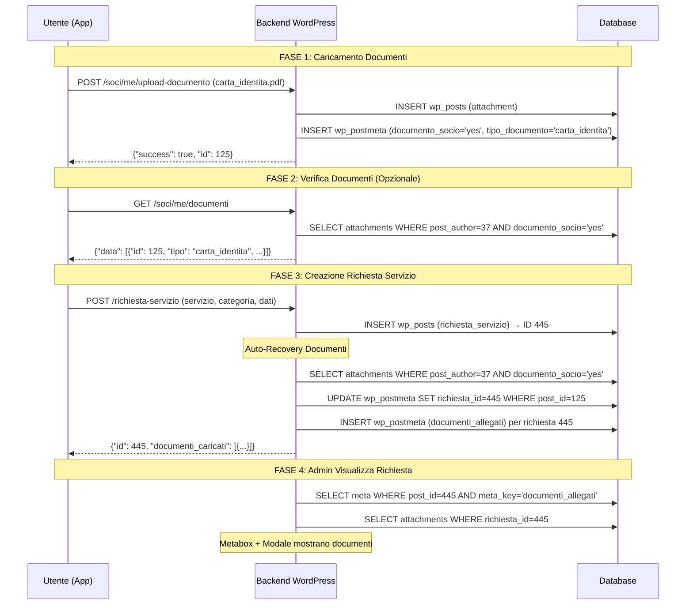

# 📋 STATO IMPLEMENTAZIONE DOCUMENTI - RISPOSTA AL TEAM FRONTEND

**Data:** 17 Febbraio 2026  
**Commit Rilevanti:** `e4e30bc8`, `4a4223dc`, `45c6be0f`  

---

## ✅ IMPLEMENTAZIONE BACKEND COMPLETATA

### 🎯 Sistema Auto-Recovery Documenti

**Commit:** `e4e30bc8` - "feat: automatic document recovery for service requests"

Il backend **HA GIÀ** implementato la logica descritta nel documento frontend:

#### Codice Implementato: `class-servizi-endpoint.php` (linea ~320)

```php
// ⭐ RECUPERA documenti già caricati dall'utente se non inviati con la richiesta
if (empty($documenti_caricati)) {
    error_log("[WECOOP API] Richiesta #{$post_id} - Nessun documento caricato con la richiesta, cerco documenti utente esistenti");
    
    // Recupera documenti dal profilo utente
    $documenti_utente = get_posts([
        'post_type' => 'attachment',
        'author' => $current_user_id,
        'posts_per_page' => -1,
        'meta_query' => [[
            'key' => 'documento_socio',
            'value' => 'yes'
        ]]
    ]);
    
    if (!empty($documenti_utente)) {
        error_log("[WECOOP API] ✅ Trovati " . count($documenti_utente) . " documenti nel profilo utente");
        
        foreach ($documenti_utente as $doc) {
            $attachment_id = $doc->ID;
            $tipo_documento = get_post_meta($attachment_id, 'tipo_documento', true);
            $data_scadenza = get_post_meta($attachment_id, 'data_scadenza', true);
            
            // Associa documento alla richiesta
            update_post_meta($attachment_id, 'richiesta_id', $post_id);
            
            $documenti_caricati[] = [
                'tipo' => $tipo_documento ?: 'altro',
                'attachment_id' => $attachment_id,
                'file_name' => basename(get_attached_file($attachment_id)),
                'url' => wp_get_attachment_url($attachment_id),
                'data_scadenza' => $data_scadenza,
            ];
            
            error_log("[WECOOP API] 📎 Collegato documento: {$tipo_documento} (ID: {$attachment_id})");
        }
        
        // Salva riferimenti documenti nella richiesta
        update_post_meta($post_id, 'documenti_allegati', $documenti_caricati);
        error_log("[WECOOP API] 📦 Totale documenti collegati dal profilo: " . count($documenti_caricati));
    } else {
        error_log("[WECOOP API] ℹ️ Nessun documento trovato nel profilo utente");
    }
}
```

### 📡 Endpoint Documenti

#### 1. Upload Documento (già esistente)

**Endpoint:** `POST /wp-json/wecoop/v1/soci/me/upload-documento`

**Implementazione:** `class-soci-endpoint.php` linea 1383

**Funzionamento:**
```php
public static function upload_documento_identita($request) {
    $current_user = wp_get_current_user();
    $user_id = $current_user->ID;
    
    // Upload file
    $attachment_id = media_handle_upload('file', 0);
    
    // Salva metadata
    update_post_meta($attachment_id, 'documento_socio', 'yes');
    update_post_meta($attachment_id, 'socio_id', $user_id);
    update_post_meta($attachment_id, 'tipo_documento', $tipo_documento);
    update_post_meta($attachment_id, 'data_upload', current_time('mysql'));
    
    // ... altri meta
}
```

✅ **Meta salvati correttamente:**
- `documento_socio = 'yes'`
- `socio_id = user_id`
- `tipo_documento` (carta_identita, passaporto, etc.)
- `data_upload`

#### 2. Lista Documenti (implementato)

**Endpoint:** `GET /wp-json/wecoop/v1/soci/me/documenti`

**Commit:** `e4e30bc8`

**Response:**
```json
{
  "success": true,
  "data": [
    {
      "id": 123,
      "title": "carta-identita.pdf",
      "filename": "carta-identita.pdf",
      "url": "https://wecoop.org/wp-content/uploads/...",
      "tipo": "carta_identita",
      "data_upload": "2026-02-17T10:30:00+00:00",
      "data_scadenza": "2028-12-31"
    }
  ]
}
```

#### 3. Creazione Richiesta con Auto-Recovery

**Endpoint:** `POST /wp-json/wecoop/v1/richiesta-servizio`

**Commit:** `e4e30bc8`

**Logica:**
1. Crea richiesta servizio
2. Se nessun documento inviato nel payload → cerca documenti utente
3. Collega automaticamente documenti trovati
4. Salva in `documenti_allegati` meta
5. Imposta `richiesta_id` su ogni attachment

---

## 🚨 PROBLEMA RILEVATO

### Debug Richiesta #444 (Utente #37)

```
❌ Meta 'documenti_allegati' è vuoto o non esiste
❌ Nessun attachment ha meta 'richiesta_id' = 444
⚠️ L'utente #37 NON ha documenti caricati nel profilo
```

### 🔎 Causa Root

**L'utente #37 NON ha MAI caricato documenti tramite l'endpoint `/soci/me/upload-documento`**

Il sistema di auto-recovery funziona correttamente, ma:
- Cerca documenti con query: `post_author = 37 AND documento_socio = 'yes'`
- **Risultato:** 0 documenti trovati
- **Azione:** Non collega nulla perché non c'è nulla da collegare
- **Log:** `"ℹ️ Nessun documento trovato nel profilo utente"`

### ✅ Soluzione

1. **L'utente deve caricare documenti PRIMA** di creare la richiesta
2. Endpoint upload funziona correttamente
3. Sistema auto-recovery li collegherà automaticamente

---

## 🧪 TEST & VERIFICA

### 1. Test Upload via Script PHP

Caricato: `test-upload-documento.php`

**URL:** `https://wecoop.org/test-upload-documento.php`

**Features:**
- ✅ Upload documenti come utente loggato
- ✅ Lista documenti esistenti
- ✅ Statistiche documenti collegati/non collegati
- ✅ Visualizzazione meta (socio_id, tipo_documento, richiesta_id)
- ✅ Istruzioni curl per test API

### 2. Test Upload via App Flutter

```dart
// 1. Upload documento
final response = await dio.post(
  '/soci/me/upload-documento',
  data: FormData.fromMap({
    'file': await MultipartFile.fromFile(file.path),
    'tipo_documento': 'carta_identita',
  }),
  options: Options(headers: {'Authorization': 'Bearer $token'}),
);

// 2. Lista documenti
final docs = await dio.get('/soci/me/documenti');
print(docs.data['data']); // Array documenti

// 3. Crea richiesta (documenti collegati automaticamente)
final richiesta = await dio.post(
  '/richiesta-servizio',
  data: {
    'servizio': 'permesso_soggiorno',
    'categoria': 'new_application',
    'dati': {'note': 'test'}
  },
);

print(richiesta.data['documenti_caricati']); // Array documenti collegati
```

### 3. Test via curl

```bash
# 1. Ottieni token JWT
TOKEN=$(curl -X POST https://wecoop.org/wp-json/jwt-auth/v1/token \
  -H "Content-Type: application/json" \
  -d '{"username":"39123456789","password":"pass"}' | jq -r '.token')

# 2. Upload documento
curl -X POST https://wecoop.org/wp-json/wecoop/v1/soci/me/upload-documento \
  -H "Authorization: Bearer $TOKEN" \
  -F "file=@carta_identita.pdf" \
  -F "tipo_documento=carta_identita"

# Response atteso:
# {
#   "success": true,
#   "message": "Documento caricato con successo",
#   "data": {
#     "id": 125,
#     "url": "https://...",
#     "tipo": "carta_identita",
#     "filename": "carta_identita.pdf"
#   }
# }

# 3. Verifica documenti
curl -X GET https://wecoop.org/wp-json/wecoop/v1/soci/me/documenti \
  -H "Authorization: Bearer $TOKEN"

# Response atteso:
# {
#   "success": true,
#   "data": [
#     {"id": 125, "tipo": "carta_identita", ...}
#   ]
# }

# 4. Crea richiesta (documenti collegati automaticamente)
curl -X POST https://wecoop.org/wp-json/wecoop/v1/richiesta-servizio \
  -H "Authorization: Bearer $TOKEN" \
  -H "Content-Type: application/json" \
  -d '{
    "servizio": "permesso_soggiorno", 
    "categoria": "new_application",
    "dati": {"note": "test"}
  }'

# Response atteso:
# {
#   "success": true,
#   "id": 445,
#   "numero_pratica": "WECOOP-2026-00002",
#   "documenti_caricati": [        ⬅️ Array popolato automaticamente!
#     {
#       "tipo": "carta_identita",
#       "attachment_id": 125,
#       "file_name": "carta_identita.pdf",
#       "url": "https://..."
#     }
#   ]
# }
```

---

## 📊 Verifica Database

### Query 1: Controllo Upload Documenti

```sql
-- Verifica che documenti siano salvati correttamente
SELECT p.ID, p.post_author, p.post_title, p.post_date,
       pm1.meta_value AS documento_socio,
       pm2.meta_value AS tipo_documento,
       pm3.meta_value AS socio_id
FROM wp57384_posts p
LEFT JOIN wp57384_postmeta pm1 ON p.ID = pm1.post_id AND pm1.meta_key = 'documento_socio'
LEFT JOIN wp57384_postmeta pm2 ON p.ID = pm2.post_id AND pm2.meta_key = 'tipo_documento'
LEFT JOIN wp57384_postmeta pm3 ON p.ID = pm3.post_id AND pm3.meta_key = 'socio_id'
WHERE p.post_type = 'attachment'
  AND p.post_author = 37  -- User ID
  AND pm1.meta_value = 'yes'
ORDER BY p.post_date DESC;
```

**Risultato atteso dopo upload:**
```
ID   | post_author | tipo_documento    | documento_socio | socio_id
-----|-------------|-------------------|-----------------|----------
125  | 37          | carta_identita    | yes             | 37
126  | 37          | codice_fiscale    | yes             | 37
```

### Query 2: Verifica Associazione Richiesta

```sql
-- Dopo creazione richiesta, verifica collegamento
SELECT p.ID, p.post_title AS documento,
       pm1.meta_value AS tipo_documento,
       pm2.meta_value AS richiesta_id
FROM wp57384_posts p
LEFT JOIN wp57384_postmeta pm1 ON p.ID = pm1.post_id AND pm1.meta_key = 'tipo_documento'
LEFT JOIN wp57384_postmeta pm2 ON p.ID = pm2.post_id AND pm2.meta_key = 'richiesta_id'
WHERE p.post_type = 'attachment'
  AND p.post_author = 37
  AND pm2.meta_value IS NOT NULL;  -- Documenti collegati a richieste
```

**Risultato atteso dopo creazione richiesta #445:**
```
ID   | documento            | tipo_documento    | richiesta_id
-----|----------------------|-------------------|-------------
125  | carta_identita.pdf   | carta_identita    | 445
126  | codice_fiscale.jpg   | codice_fiscale    | 445
```

### Query 3: Verifica Meta documenti_allegati

```sql
-- Verifica array documenti nella richiesta
SELECT p.ID, p.post_title, pm.meta_value AS documenti_allegati
FROM wp57384_posts p
LEFT JOIN wp57384_postmeta pm ON p.ID = pm.post_id AND pm.meta_key = 'documenti_allegati'
WHERE p.post_type = 'richiesta_servizio'
  AND p.ID = 445;
```

**Risultato atteso:**
```
ID   | post_title                  | documenti_allegati
-----|-----------------------------|-------------------------------------------------
445  | WECOOP-2026-00002 - ...     | a:2:{i:0;a:5:{s:4:"tipo";s:14:"carta_identita"...
```

---

## 🎯 CHECKLIST VERIFICA FUNZIONAMENTO

### Per l'utente #37 (o qualsiasi altro utente)

- [ ] **Step 1:** Login nell'app Flutter come utente 37
- [ ] **Step 2:** Vai nella sezione "I miei documenti"
- [ ] **Step 3:** Carica almeno 1 documento (es. carta d'identità)
- [ ] **Step 4:** Verifica che l'upload ritorni `success: true`
- [ ] **Step 5:** Verifica che il documento appaia nella lista documenti
- [ ] **Step 6:** (Opzionale) Usa `/debug-documenti-richiesta.php?richiesta_id=444` per verificare che l'utente ora ha documenti
- [ ] **Step 7:** Crea una nuova richiesta servizio (es. Permesso di Soggiorno)
- [ ] **Step 8:** Verifica nella response `documenti_caricati` array popolato
- [ ] **Step 9:** Apri la richiesta in wp-admin → Verifica "Documenti Allegati" visibili
- [ ] **Step 10:** Clicca "Modifica" nella lista richieste → Modale mostra sezione documenti

---

## 📈 LOGS DA MONITORARE

Dopo l'implementazione, questi log dovrebbero apparire in `wp-content/debug.log`:

### Upload Documento
```
[17-Feb-2026 10:30:15] WECOOP: Documento caricato - User:37 Tipo:carta_identita ID:125
```

### Creazione Richiesta (Con Documenti)
```
[17-Feb-2026 10:35:22] [WECOOP API] Richiesta #445 - Nessun documento caricato con la richiesta, cerco documenti utente esistenti
[17-Feb-2026 10:35:22] [WECOOP API] ✅ Trovati 2 documenti nel profilo utente
[17-Feb-2026 10:35:22] [WECOOP API] 📎 Collegato documento: carta_identita (ID: 125)
[17-Feb-2026 10:35:22] [WECOOP API] 📎 Collegato documento: codice_fiscale (ID: 126)
[17-Feb-2026 10:35:22] [WECOOP API] 📦 Totale documenti collegati dal profilo: 2
```

### Creazione Richiesta (Senza Documenti) - CASO ATTUALE
```
[17-Feb-2026 10:40:10] [WECOOP API] Richiesta #444 - Nessun documento caricato con la richiesta, cerco documenti utente esistenti
[17-Feb-2026 10:40:10] [WECOOP API] ℹ️ Nessun documento trovato nel profilo utente
```

---

## 🔄 FLUSSO COMPLETO FUNZIONANTE



---

## 💡 CONCLUSIONI

### ✅ Backend Implementazione Completa

Il backend WordPress ha **tutte le funzionalità richieste**:

1. ✅ Endpoint upload documenti (`/soci/me/upload-documento`)
2. ✅ Endpoint lista documenti (`/soci/me/documenti`)
3. ✅ Sistema auto-recovery documenti (commit `e4e30bc8`)
4. ✅ Associazione automatica documenti → richieste
5. ✅ Salvataggio meta `documenti_allegati` e `richiesta_id`
6. ✅ Visualizzazione documenti in admin (metabox + modale)
7. ✅ Script debug per troubleshooting

### ⚠️ Problema Attuale

**L'utente #37 non ha documenti caricati nel profilo.**

Questo NON è un bug del backend, ma significa che:
- L'endpoint `/soci/me/upload-documento` non è stato mai usato da questo utente
- Oppure l'app frontend non sta chiamando questo endpoint
- Oppure ci sono errori nell'upload che non vengono mostrati all'utente

### 📝 Azioni Richieste dal Team Frontend

1. **Verificare endpoint upload nell'app:**
   - L'app sta chiamando `/soci/me/upload-documento`?
   - Gestisce correttamente multipart/form-data?
   - Mostra errori all'utente se l'upload fallisce?

2. **Test con utente reale:**
   - Testare upload via app con utente #37
   - Verificare response dell'endpoint
   - Controllare che documento appaia in `/soci/me/documenti`

3. **Usare script di test:**
   - `test-upload-documento.php` per test manuali
   - `debug-documenti-richiesta.php` per verificare stato

---

## 📞 Script Disponibili

### 1. Test Upload
**URL:** `https://wecoop.org/test-upload-documento.php`
- Upload documenti come utente loggato
- Visualizza documenti esistenti
- Istruzioni API

### 2. Debug Richiesta
**URL:** `https://wecoop.org/debug-documenti-richiesta.php?richiesta_id=444`
- Info richiesta
- Meta documenti_allegati
- Attachment collegati
- Documenti profilo utente
- Diagnosi problemi

---

**Prepared by:** Backend Team  
**Date:** 17 Febbraio 2026  
**Status:** ✅ Implementazione Completata - In Attesa di Test Frontend
