# 🔐 API PRIMO ACCESSO - Documentazione

## 📋 OVERVIEW

Endpoint per la **registrazione semplificata** degli utenti nell'app Flutter.  
Sistema a **due fasi**:

1. **Primo Accesso** (questo endpoint) - Utente registra solo 4 campi
2. **Diventa Socio** (operatore CRM) - Completamento dati e approvazione

---

## 🌐 ENDPOINT

### **POST /wp-json/wecoop/v1/utenti/primo-accesso**

**Descrizione:**  
Crea una richiesta di adesione "light" con dati minimi. La richiesta viene salvata con status `pending` e dovrà essere completata e approvata dall'operatore CRM.

**Autenticazione:** Non richiesta (pubblico)

---

## 📥 REQUEST

### Headers

```http
Content-Type: application/json
```

### Body (JSON)

```json
{
  "nome": "Mario",
  "cognome": "Rossi",
  "prefix": "+39",
  "telefono": "3331234567"
}
```

### Parametri

| Campo | Tipo | Obbligatorio | Descrizione | Esempio |
|-------|------|--------------|-------------|---------|
| `nome` | string | ✅ Sì | Nome utente (min. 2 caratteri) | `"Mario"` |
| `cognome` | string | ✅ Sì | Cognome utente (min. 2 caratteri) | `"Rossi"` |
| `prefix` | string | ✅ Sì | Prefisso telefonico internazionale | `"+39"` |
| `telefono` | string | ✅ Sì | Numero telefono senza prefisso | `"3331234567"` |

**Note:**
- Il sistema concatena automaticamente `prefix + telefono` per creare `telefono_completo`
- Il numero completo viene usato per verificare duplicati
- Non sono richiesti email, nazionalità, privacy o altri campi

---

## 📤 RESPONSE

### Success (200 OK)

```json
{
  "success": true,
  "message": "Richiesta di adesione inviata con successo! Ti contatteremo presto.",
  "data": {
    "id": 123,
    "numero_pratica": "RS-2025-00123",
    "status": "pending",
    "nome": "Mario",
    "cognome": "Rossi",
    "prefix": "+39",
    "telefono": "3331234567",
    "telefono_completo": "+393331234567"
  }
}
```

### Campi Response

| Campo | Tipo | Descrizione |
|-------|------|-------------|
| `success` | boolean | Sempre `true` in caso di successo |
| `message` | string | Messaggio di conferma per l'utente |
| `data.id` | integer | ID univoco della richiesta (post_id) |
| `data.numero_pratica` | string | Numero pratica formato `RS-ANNO-XXXXX` |
| `data.status` | string | Stato richiesta (sempre `"pending"`) |
| `data.telefono_completo` | string | Telefono completo con prefisso |

---

## ❌ ERRORI

### Errore: Campi Mancanti (400)

**Scenario:** Uno o più campi obbligatori non forniti

```json
{
  "code": "invalid_data",
  "message": "Nome, cognome, prefix e telefono sono obbligatori",
  "data": {
    "status": 400
  }
}
```

### Errore: Telefono Duplicato (400)

**Scenario:** Numero telefono già registrato nel database

```json
{
  "code": "duplicate_phone",
  "message": "Telefono già registrato",
  "data": {
    "status": 400
  }
}
```

### Errore: Server Error (500)

**Scenario:** Errore interno del server

```json
{
  "code": "server_error",
  "message": "Errore critico: [dettagli]",
  "data": {
    "status": 500
  }
}
```

---

## 🧪 ESEMPI

### cURL

```bash
curl -X POST https://www.wecoop.org/wp-json/wecoop/v1/utenti/primo-accesso \
  -H "Content-Type: application/json" \
  -d '{
    "nome": "Mario",
    "cognome": "Rossi",
    "prefix": "+39",
    "telefono": "3331234567"
  }'
```

### Dart/Flutter (Dio)

```dart
import 'package:dio/dio.dart';

Future<Map<String, dynamic>> primoAccesso({
  required String nome,
  required String cognome,
  required String prefix,
  required String telefono,
}) async {
  final dio = Dio();
  
  try {
    final response = await dio.post(
      'https://www.wecoop.org/wp-json/wecoop/v1/utenti/primo-accesso',
      data: {
        'nome': nome,
        'cognome': cognome,
        'prefix': prefix,
        'telefono': telefono,
      },
    );
    
    if (response.statusCode == 200) {
      return response.data;
    }
  } on DioException catch (e) {
    if (e.response?.statusCode == 400) {
      final errorCode = e.response?.data['code'];
      if (errorCode == 'duplicate_phone') {
        throw Exception('Numero telefono già registrato');
      } else if (errorCode == 'invalid_data') {
        throw Exception('Dati non validi');
      }
    }
    throw Exception('Errore di connessione');
  }
  
  throw Exception('Risposta non valida');
}
```

### JavaScript (Fetch)

```javascript
async function primoAccesso(nome, cognome, prefix, telefono) {
  const response = await fetch('https://www.wecoop.org/wp-json/wecoop/v1/utenti/primo-accesso', {
    method: 'POST',
    headers: {
      'Content-Type': 'application/json',
    },
    body: JSON.stringify({
      nome,
      cognome,
      prefix,
      telefono,
    }),
  });
  
  const data = await response.json();
  
  if (!response.ok) {
    if (data.code === 'duplicate_phone') {
      throw new Error('Telefono già registrato');
    }
    throw new Error(data.message || 'Errore durante la registrazione');
  }
  
  return data;
}
```

---

## 💾 DATABASE

### Tabella: `wp_posts` (Custom Post Type)

Le richieste vengono salvate come Custom Post Type `richiesta_socio`:

```sql
-- Post principale
INSERT INTO wp_posts (
  post_type,
  post_title,
  post_status,
  post_author
) VALUES (
  'richiesta_socio',
  'Mario Rossi',
  'pending',
  1
);
```

### Post Meta

```sql
-- Dati salvati in wp_postmeta
INSERT INTO wp_postmeta (post_id, meta_key, meta_value) VALUES
  (123, 'nome', 'Mario'),
  (123, 'cognome', 'Rossi'),
  (123, 'prefix', '+39'),
  (123, 'telefono', '3331234567'),
  (123, 'telefono_completo', '+393331234567'),
  (123, 'numero_pratica', 'RS-2025-00123'),
  (123, 'profilo_completo', '0');
```

---

## 🔄 FLUSSO COMPLETO

```mermaid
sequenceDiagram
    participant App as App Flutter
    participant API as WordPress API
    participant DB as Database
    participant CRM as Operatore CRM
    
    App->>API: POST /utenti/primo-accesso
    API->>API: Valida dati (nome, cognome, prefix, telefono)
    API->>DB: Verifica telefono duplicato
    alt Telefono già esistente
        DB-->>API: Trovato
        API-->>App: Error 400 (duplicate_phone)
    else Telefono nuovo
        DB-->>API: Non trovato
        API->>DB: Crea richiesta (status=pending)
        API->>DB: Genera numero_pratica
        DB-->>API: ID richiesta
        API-->>App: Success 200 + dati
        App->>App: Mostra conferma utente
        Note over CRM: Operatore vede richiesta in CRM
        CRM->>CRM: Contatta utente
        CRM->>CRM: Completa dati mancanti
        CRM->>API: Approva richiesta
        API->>DB: Crea utente WordPress
        API->>DB: Aggiorna status → socio
    end
```



---

## 🔧 INTEGRAZIONE CRM

### Visualizzazione Richieste Pending

Le richieste vengono visualizzate nel CRM WordPress:

**Dashboard:** `wp-admin/edit.php?post_type=richiesta_socio`

**Filtri disponibili:**
- Status: `pending`, `approved`, `rejected`
- Ordinamento: Data richiesta
- Ricerca: Nome, cognome, telefono

### Completamento Dati

L'operatore CRM può:

1. **Visualizzare** la richiesta
2. **Contattare** l'utente via telefono/WhatsApp
3. **Completare** i dati mancanti (email, nazionalità, documenti, ecc.)
4. **Approvare** → Crea utente WordPress + tessera socio
5. **Rifiutare** → Chiude la richiesta

---

## 📊 STATISTICHE

### Numero Pratica

Formato: `RS-ANNO-NUMERO`

- `RS` = Richiesta Semplificata
- `ANNO` = Anno corrente (2025)
- `NUMERO` = Sequenziale a 5 cifre (00001, 00002, ...)

**Esempio:** `RS-2025-00123`

Il numero è univoco e viene generato automaticamente al momento della creazione.

---

## 🚀 ENDPOINT ALTERNATIVI

### Alias per Retrocompatibilità

**POST /wp-json/wecoop/v1/soci/richiesta**

Stesso comportamento dell'endpoint `/utenti/primo-accesso`.  
Mantenuto per compatibilità con versioni precedenti dell'app.

---

## 📝 NOTE TECNICHE

### Validazione Telefono

- Il sistema **non valida** il formato del numero telefonico
- Accetta qualsiasi stringa per `telefono`
- La concatenazione avviene sempre: `prefix + telefono`
- Esempio: `"+39" + "3331234567"` = `"+393331234567"`

### Controllo Duplicati

Il controllo duplicati cerca in **tutte** le richieste (pending + approved):

```sql
SELECT * FROM wp_posts p
JOIN wp_postmeta pm ON p.ID = pm.post_id
WHERE p.post_type = 'richiesta_socio'
  AND pm.meta_key = 'telefono_completo'
  AND pm.meta_value = '+393331234567'
  AND p.post_status IN ('pending', 'publish')
LIMIT 1
```

### Performance

- **Query database:** 1-2 query per richiesta
- **Tempo medio:** < 200ms
- **Rate limiting:** Non implementato (da valutare)

---

## 🔐 SICUREZZA

### Protezione XSS

Tutti i campi vengono sanitizzati con `sanitize_text_field()`:

```php
$nome = sanitize_text_field($params['nome']);
$cognome = sanitize_text_field($params['cognome']);
$prefix = sanitize_text_field($params['prefix']);
$telefono = sanitize_text_field($params['telefono']);
```

### SQL Injection

WordPress utilizza `wpdb->insert()` con prepared statements.  
Nessun rischio di SQL injection.

### Rate Limiting

⚠️ **NON IMPLEMENTATO**  
Considerare l'aggiunta di rate limiting per prevenire spam:

- Max 5 richieste per IP ogni 10 minuti
- Max 1 richiesta per telefono ogni 24 ore

---

## 🐛 TROUBLESHOOTING

### Errore: "duplicate_phone" ma numero nuovo

**Possibile causa:** Spazi o caratteri speciali nel numero

**Soluzione:** Pulire il numero prima dell'invio:
```dart
final telefonoClean = telefono.replaceAll(RegExp(r'[^\d]'), '');
```

### Errore: "server_error"

**Possibile causa:** Plugin non attivo o database non accessibile

**Soluzione:** 
1. Verificare che plugin `wecoop-soci` sia attivo
2. Controllare log WordPress: `wp-content/debug.log`
3. Verificare permessi database

### Numero pratica non generato

**Possibile causa:** Errore durante `wp_insert_post()`

**Soluzione:**
1. Controllare log: `[SOCI] Post richiesta creato con ID: XXX`
2. Verificare permessi utente (deve essere admin)

---

## 📞 SUPPORTO

**Developer Backend:** WordPress Plugin `wecoop-soci`  
**Developer Frontend:** App Flutter

**Log Location:** `/home/u703617904/logs/error_log` (server)  
**Search Pattern:** `[SOCI]` per filtrare log rilevanti

---

**Versione API:** 1.0  
**Ultima Modifica:** 28 Dicembre 2025  
**Status:** ✅ Production Ready
